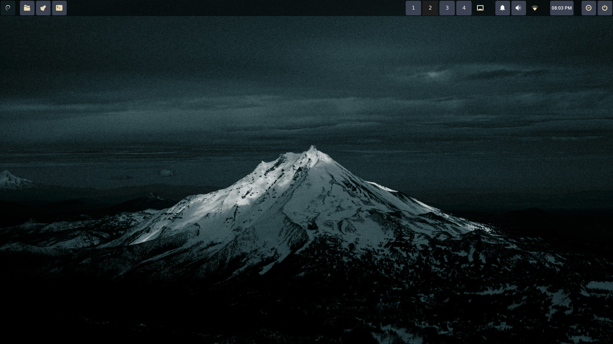

# My XFCE GTK config

My config for XFCE



## Tech
- Icon : Gruvbox-Dark
- WM : XFWM
- Theme : Adwaita-Dark

**Prerequisites**  
- XFCE 4.16+  
- git  
- gtk-3 support
- fonts-roboto

## Installation
```bash
#GruvBox Icons
git clone https://github.com/SylEleuth/gruvbox-plus-icon-pack.git ~/gruvbox-icons
mkdir -p ~/.local/share/icons/
mv ~/gruvbox-icons/Gruvbox-Plus-Dark/ ~/.local/share/icons/

#Theme
git clone https://github.com/ashwinpshinewrk/xfce-config
cd xfce-config
mv ~/.config/gtk-3.0 ~/.config/gtk-3.0_bak #backup old config
mv ./gtk-3.0/ ~/.config/. #put new config 

xfce4-panel -r #reload the panel
```

## Next Steps

- Choose and set a wallpaper (either your own or one provided in the repo).  
- Configure panel items in this order:
  1. Whisker-menu  
  2. Separator  
  3. Four launchers  
  4. Expanded separator  
  5. Workspace-switcher  
  6. Window-menu  
  7. Notification plugin  
  8. PulseAudio plugin  
  9. Status-tray plugin  
  10. Clock  
  11. Action buttons
- Separators are all transparent.

